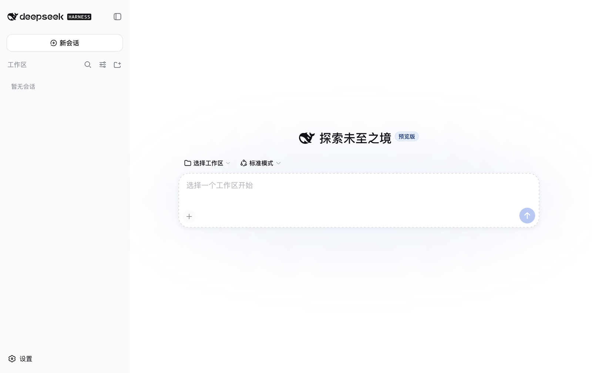
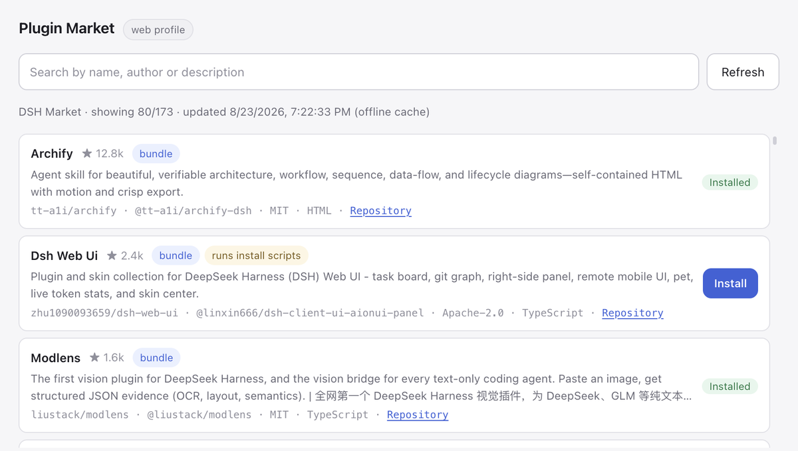
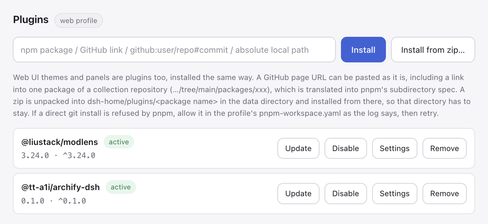
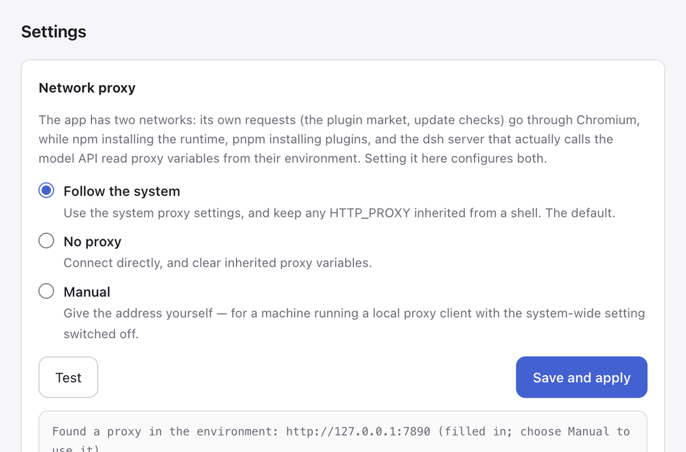
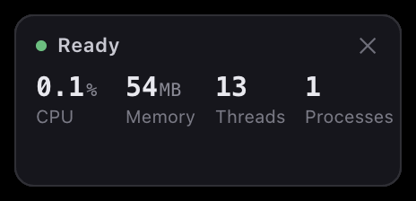

# dsh Desktop

English | [简体中文](README.zh-CN.md)

[](https://github.com/huyang218/dsh-desktop/releases/latest)
[](LICENSE)
[](#platform-support)

A desktop app for [DeepSeek Harness](https://github.com/deepseek-ai/deepseek-harness) (`dsh`): it installs and updates the runtime, owns the server process and its storage, and puts the web UI in a window.

> **Unofficial project.** Not affiliated with or endorsed by DeepSeek. `dsh`
> itself is published by its authors on npm; this app is only a shell around
> it. The two ship independently — the app never bundles a copy of `dsh` into
> its own source tree.

The repository is named `dsh-desktop`; the packaged application is named **DeepSeek Harness** (see [Trademarks](#trademarks)).

<p align="center">
  
</p>

## Download

Installers are attached to every [release](https://github.com/huyang218/dsh-desktop/releases/latest). Nothing needs to be preinstalled — the build carries its own Node runtime, and `dsh` itself is fetched on first launch.

| Platform | File |
|---|---|
| **macOS** (Apple Silicon) | `DeepSeek Harness-<version>-arm64.dmg` |
| **macOS** (Intel) | `DeepSeek Harness-<version>-x64.dmg` |
| **Windows** 10 (1803+) / 11 | `DeepSeek Harness Setup <version>.exe` |

macOS builds are ad-hoc signed and not notarized, so the first launch needs approval under System Settings → Privacy & Security. Conversations need a DeepSeek API key, entered in the web UI on first run.

## What it looks like

<table>
<tr>
<td width="50%" valign="top">

<br><b>Plugin Market</b> — the DSH Market catalog in a window, searchable, cached for offline browsing, one click to install a verified entry.
</td>
<td width="50%" valign="top">

<br><b>Plugin manager</b> — install by npm name, GitHub URL, local path or zip; update, switch off, configure or remove what is installed.
</td>
</tr>
<tr>
<td width="50%" valign="top">

<br><b>One proxy setting, two networks</b> — the window's own requests go through Chromium; npm, pnpm and the <code>dsh</code> server read the environment. Set once, tested separately.
</td>
<td width="50%" valign="top">

<br>
<br><b>Performance badge</b> — what the harness costs right now, across the whole process group. A real CPU rate, not the lifetime average <code>ps</code> reports.
</td>
</tr>
</table>

Sibling projects: [dsh-android](https://github.com/huyang218/dsh-android) puts the same runtime on a phone, and [dsh-plugins](https://github.com/huyang218/dsh-plugins) is a collection of plugins the plugin manager here installs directly. See [Related projects](#related-projects).

## Why

`npx dsh web` already works. What it leaves to you is everything around it: where the runtime lives, how it gets upgraded, which port to use when one is taken, whether child processes survive the app, where `DSH_HOME` points, and who restarts the server when it dies. This app owns all of that.

## What it does

| | |
|---|---|
| **Dual-slot updates** | The runtime is installed by npm into `runtime/slot-a` or `slot-b`, with `current.json` naming the active one. An update installs into the idle slot, boots a probe server against it, and only moves the pointer once that self-test passes — a failed upgrade leaves the working version untouched. The previous version stays in the other slot, and one menu item goes back to it — no network, no reinstall. |
| **Update channels** | `dsh` publishes a new build to npm's `next` dist-tag first and moves `latest` later, so a version can be plainly released and still be invisible to anyone tracking `latest`. Stable follows `latest`, Preview follows `next`, and the check reads both tags in the one request it already makes — so being up to date on Stable can say that Preview holds something newer, rather than leaving that as a puzzle. A channel that points *below* the installed version offers the move down as what it is, and the self-test and the other slot apply to it exactly as they do to an upgrade. |
| **App self-update** | The version here against the newest GitHub release, in two flavours. A **hot update**, when the new version only changes the shell (JavaScript and markup): a few hundred KB into the data directory, live after a restart, with the installed app bundle untouched — so its signature, and the privacy permissions macOS binds to it, survive. An **installer update**, when Electron or the bundled runtime changed: the app downloads the installer and hands it to you. Checked once, quietly, after startup, and from the menu whenever you like. |
| **Process ownership** | The server starts with the window on a random free port and loads once it answers HTTP 200. It runs in its own process group (POSIX) or job tree (Windows), and the whole tree is terminated when the app quits — no orphans. |
| **Supervision** | An unplanned exit — including an OOM abort, which arrives as a signal rather than an exit code — is restarted automatically, backing off 1s/3s/8s. Three consecutive failures raise a dialog instead of spinning. A server that stays up for a minute earns a fresh budget, so an occasional crash always gets the full three attempts. |
| **Recoverable start** | A server that misses the readiness deadline offers a retry rather than killing the app: on a busy disk it is usually just slow, not broken. If a plugin was installed or switched on moments earlier, the dialog names it and offers to undo that step and restart — installing a bad plugin should not leave the user guessing which one it was. |
| **Files into the chat** | Three ways in, one destination: Finder's Open With and a drop on the Dock icon on macOS, the Send to menu on Windows (a switch in Settings writes the shortcut), and dragging onto the window on either. The file's path goes into the composer — dsh is an agent with filesystem tools, so a path is what it can act on, and it stays true for a file too big to paste. The insertion is read back rather than assumed: when the composer will not take it (no workspace open, say) the paths go to the clipboard with a note to paste, so the feature degrades to one keystroke rather than to silence. A drop the page itself claims is left alone. |
| **Living in the background** | It is a service that happens to have a window: it can open at login, start straight into the tray without a window, and it remembers the window's size and position (a saved rectangle on a monitor that has since been unplugged is discarded, rather than opening the window where it cannot be seen). |
| **Storage** | `DSH_HOME` points inside the app's data directory, so profiles, sessions and settings are all owned by the app. The menu opens the data directory and the log directly. A snapshot of the data can be exported and restored — the runtime can fall back a slot, the shell can fall back to the packaged copy, a plugin can be switched off, and sessions had no way back at all until this. A restore checks the archive is a data-directory snapshot first, and the directory it replaces is renamed aside rather than deleted. |
| **Proxy setting** | The app has two unrelated networks: its own requests go through Chromium, while npm (the runtime), pnpm (plugins) and the `dsh` server that calls the model API read proxy variables from their environment. A GUI app launched from Finder or the Start menu gets neither — the proxy exported in a shell profile is invisible to it, and the system-wide setting is often switched off. Settings → Proxy… configures both at once, and tests each separately. |
| **Bundled toolchain** | Packaged builds carry their own Node runtime, so a target machine needs nothing preinstalled. Running from source falls back to finding Node ≥ 22 on the machine (PATH, nvm, Homebrew, `%ProgramFiles%`), which also sidesteps GUI apps not inheriting a shell `PATH`. That inheritance is the wider problem: `dsh` looks on `PATH` for pnpm to install plugins and for the Claude Code and Codex CLIs it can delegate to, and a double-clicked app on macOS is handed `/usr/bin:/bin:/usr/sbin:/sbin`. So the user's own shell is asked, once per run, what its `PATH` is — which covers whichever version manager and install location they actually use, rather than a list of the ones we thought of — and the answer is appended, with the usual package-manager directories behind it for when the shell cannot be asked. |
| **Plugin manager** | Install, update and remove `dsh` plugins from a window: by npm name, GitHub page URL (including a link to one package of a collection repository, `…/tree/main/packages/xxx`, as in [dsh-plugins](https://github.com/huyang218/dsh-plugins)), `github:` spec, absolute local path, or a zip package — a zip is unpacked into `<data dir>/dsh-home/plugins/<package name>` and installed from there as a local path. Installed plugins are checked in the background against the registry npm is configured to use (mirrors included), and a newer version is flagged. A plugin can be switched off and back on without uninstalling — that writes `disabled: true` on its loader row, the runtime's own mechanism, rather than editing the profile's bundle list, which `dsh plugin` rebuilds from what is installed on every operation. A plugin that exports a config schema gets a generated form; values are written to the profile's `plugin-config.json` and mirrored, along with the switched-off state, into a marked block in `cordis.patch.yml`. |
| **Performance badge** | A small always-on-top window, toggled from the menu, showing what the harness is costing right now: CPU, resident memory, threads and how many processes the group holds. The rate is a rate — `ps` reports CPU averaged over a process's whole life, which for a server that has been up since Tuesday is a number about the past, so this samples cumulative CPU time twice and divides by the wall clock between. The whole process group is counted, because dsh delegates to pnpm and to other CLIs and those are as much the cost as the parent. It samples only while it is on screen. |
| **Plugin market** | Its own window (Plugins → Plugin Market…): the [DSH Market](https://dshplugin.market/) catalog, searchable, with stars and descriptions, one click to install. The catalog is cached locally (no network for six hours, refreshable by hand), so browsing works offline. One-click install is offered only for entries the market has verified and that ship on npm; a git-hosted entry gets a repository link and is installed by hand from the Installed tab. The source is the `marketCatalogUrl` setting — see [Data locations](#data-locations). |
| **Browser panel** | A page the agent just wrote used to open in Safari — a different application from the conversation that produced it. It opens in a panel beside the chat instead, and the agent can work it: navigate, snapshot, click, type, read the console and the network. The same verbs are a command line (`dsh-browser`) and agent tools (`mcp__browser__*`), all speaking to one socket the shell owns, so anything the agent runs — bash, a script, a plugin — reaches the same browser. |
| **Mini program simulator** | Drives the WeChat DevTools installed on the machine (its licence forbids bundling it, so the app finds and drives the user's copy — or the one configured under 模拟设备 → 模拟器位置). The agent gets the simulator as tools (`mcp__miniapp__*`, or `dsh-miniapp` on a command line): open a project, read the page as refs with live text and geometry, tap, type, and — further than a browser reaches — read and write page data and call `wx.*` APIs directly, so a state worth looking at can be entered instead of clicked towards. A DevTools this app started is quit on exit; one the user already had open is borrowed and left as found. |
| **Phone simulator** | Google's Android emulator, driven over adb: boot a virtual device, read the screen as refs from the live accessibility tree, tap, type, swipe, install an APK, read logcat (`mcp__phone__*`, or `dsh-phone`). Every action re-reads the screen and re-finds its target by identity before touching it, so a list that scrolled gets tapped where it is now — and a target that is gone is reported gone rather than tapped where it used to be. A machine with no SDK is offered a download (~2.1GB, resumable, watchable, cancellable) after agreeing to Google's terms — the app never agrees on the user's behalf. Third-party emulators (MuMu, LDPlayer, Nox…) and real phones can be attached by name; unnamed, the app only ever picks a virtual device on its own. iOS simulators are listed and can be booted, but Apple ships no way to inject input, so they can be looked at and not driven. |

## Running from source

```sh
npm install
npm start
```

The first launch installs `@deepseek-ai/dsh@latest` from npm (needs network, takes a few minutes). Data and logs live in the [data directory](#data-locations).

On macOS the first `npm start` uses the installed Electron distribution to create a branded development app under `node_modules/.cache/dsh-desktop-dev`. Later starts only refresh the current `src/` and `assets/` trees and renew the ad-hoc signature. The menu bar, Dock and window therefore all say **DeepSeek Harness** while still running the current source, without downloading Electron again. Use `npm run start:electron` only when debugging the raw host; that command is expected to show **Electron** in the menu bar.

That development app carries its own bundle identifier so macOS never has to choose between it and an installed build, but it shares the [data directory](#data-locations) — which is the point, since it is usually there to debug real sessions. One consequence is worth knowing: only one of the two can run at a time, and because they now look identical, a `npm start` that finds an installed build already running stops with a message and a failing exit code instead of quietly bringing that other window forward. Quit it first. App updates are also switched off in a source run — the shell it downloads is one a source launch will not start — while runtime updates stay available.

### If `npm install` fails downloading Electron

Electron's postinstall fetches a ~100 MB runtime from GitHub Releases, which does **not** go through the npm registry — changing the registry alone will not fix it. On a network where GitHub is unreachable or reset (`RequestError: read ECONNRESET` under `node_modules/electron`), point both downloaders at a mirror.

Windows (`cmd`, same window as the commands that follow):

```cmd
set ELECTRON_MIRROR=https://npmmirror.com/mirrors/electron/
set ELECTRON_BUILDER_BINARIES_MIRROR=https://npmmirror.com/mirrors/electron-builder-binaries/
```

macOS / Linux:

```sh
export ELECTRON_MIRROR=https://npmmirror.com/mirrors/electron/
export ELECTRON_BUILDER_BINARIES_MIRROR=https://npmmirror.com/mirrors/electron-builder-binaries/
```

To persist them, add the same keys to `.npmrc` in lowercase (`electron_mirror=…`), which npm exports to lifecycle scripts. Note that `npm config set electron_mirror …` is **rejected** by npm 9 and newer — it validates key names and these are not npm's own options.

The second variable matters at build time rather than install time: `electron-builder` downloads its own helper binaries (NSIS, winCodeSign) from GitHub too, so setting only the first one walks into the same failure during `npm run dist:win`.

A failed install leaves `node_modules` half-written — and on Windows, `EPERM: operation not permitted, rmdir` during npm's cleanup means a process is holding files open (antivirus, an editor, Explorer). Close whatever holds the directory, delete `node_modules`, and install again.

## Building

Packaging **snapshots the packaging machine**. `npm run seed` — which every `dist` script runs first — writes two archives into the project root:

- `seed.tar` — the `dsh` runtime currently installed in this machine's data directory
- `node-runtime.tgz` — this machine's Node binary plus npm, so the installed app needs no preinstalled Node

Two consequences follow. **Run the app once before building**, or there is no runtime to snapshot and the build stops with `No active local dsh runtime`. And **build each platform's package on that platform** — a macOS-built Windows installer would contain a macOS Node binary. Cross-compiling is only possible by giving up the offline seed and downloading Node per target instead.

The first consequence can be relaxed on a build machine: `node scripts/prepare-seed.mjs --bootstrap` (or `DSH_SEED_BOOTSTRAP=1`, which survives npm's pre-hooks) installs a runtime first when the machine has none, then snapshots it. That is how CI builds. The second cannot be relaxed, which is what the Actions workflow is for.

### GitHub Actions

`.github/workflows/build.yml` builds on three machines: macOS Apple Silicon (`macos-14`), macOS Intel (`macos-15-intel`) and Windows (`windows-latest`). It runs on demand, or when a `v*` tag is pushed.

Three rows, because packaging snapshots the host: an Intel dmg has to come off an Intel runner. `macos-13`, which used to be that runner, has been retired — `macos-15-intel` replaces it and is a standard runner, free on a public repository. The two mac rows differ only in which host they land on; electron-builder takes the architecture from there.

A tag build uploads the installers straight to that release, using the `gh` CLI already on every runner rather than a third-party action. A manual run does **not** upload them by default: a free account gets 500MB of artifact storage and a single dmg is over 200MB, so three platforms would fill it — tick `upload` in the run dialog when the installers are what you want, and delete them afterwards.

The Node version pinned by `setup-node` is not only the build tool: `npm run seed` copies that binary and npm into the app, so it is the Node the packaged app ships and runs `dsh` on.

Signing matches a local build — ad-hoc on macOS, unsigned on Windows. A comment at the end of the workflow lists the secrets to add once an Apple Developer ID exists. Beyond Gatekeeper, the practical gain is that macOS binds a privacy permission (the Documents folder, say) to the app's code signature, and an ad-hoc signature changes with every build — so every update silently revokes what the user granted. A Developer ID signature is stable across builds and ends that.

### macOS

```sh
npm install
npm start          # once, so the dsh runtime is installed
npm run dist       # dist/mac-arm64/DeepSeek Harness.app
npm run dist:mac   # dist/DeepSeek Harness-<version>-arm64.dmg
```

Builds are ad-hoc signed by `scripts/adhoc-sign.cjs` (an `afterPack` hook) and not notarized. Without that signature the renamed Electron binary carries a stale one, and Gatekeeper reports a quarantined copy as "damaged" rather than showing the normal unidentified-developer prompt.

### Windows

Requirements: Windows 10 1803 or newer (for `tar.exe` in System32), [Node.js](https://nodejs.org) ≥ 22, and Git.

```powershell
git clone https://github.com/huyang218/dsh-desktop.git
cd dsh-desktop
npm install
npm start          # once, so the dsh runtime is installed under %APPDATA%
npm run dist:win   # NSIS installer
npm run dist       # or: unpacked app only, no installer
```

Output:

```
dist\
├── dsh-desktop Setup <version>.exe   NSIS installer
└── win-unpacked\                     unpacked app (npm run dist)
```

The installer is per-user and lets the user choose the install directory (`oneClick: false`, `perMachine: false`), so it needs no administrator rights. It is unsigned: SmartScreen will warn on first run until the executable earns reputation or you add a code-signing certificate under `build.win.certificateFile`.

`npm start` must come first here too. Skipping it fails during `predist` with `No active local dsh runtime under %APPDATA%\dsh-desktop\runtime`.

After installing, verify the three things listed under [Platform support](#platform-support) — above all that quitting the app leaves no orphaned `node` processes.

A few Windows differences in the newer features, handled in the implementation: a hot update is unpacked inside the data directory and renamed into place rather than staged in the system temp directory, because a rename across drives fails with `EXDEV`; a plugin zip holding an entry name Windows cannot store safely is refused (a `:` would write into another file's alternate data stream, `CON`/`LPT1` and friends are device names, and a trailing dot or space is silently stripped); and Open at Login registers a per-user startup entry, with `openAsHidden` being macOS-only — on Windows the app's own Start in the Tray setting decides. An installer update downloads the `.exe`, which needs the app closed before it runs.

## Menu

| Item | Effect |
|---|---|
| Plugins → Plugin Market… | Browse the catalog, search, install with one click |
| Plugins → Manage Plugins… | Install, update, configure and remove installed plugins |
| Settings → Proxy… | Network proxy, applied to the app's own requests and to every child process |
| Settings → Runtime Update Channel | Stable or Preview: which npm dist-tag runtime update checks follow. Stable by default |
| Check for App Updates | Against the newest release; hot-updates when it can, downloads the installer when it cannot |
| Check for Runtime Updates | Dual-slot `dsh` runtime update on the chosen channel, with a restart prompt after the self-test passes |
| Roll Back to dsh &lt;version&gt; | Switch to the previous version still sitting in the other slot; absent when that slot is empty or holds the same version |
| Settings → Open at Login / Start in the Tray | The two background-residency switches |
| Restart service | Stops the current server tree and starts the same version again |
| Open data directory / Open log | |

## Data locations

| Platform | Path |
|---|---|
| macOS | `~/Library/Application Support/dsh-desktop/` |
| Windows | `%APPDATA%\dsh-desktop\` |

```
dsh-desktop/
├── runtime/            installed dsh, slot-a | slot-b, current.json
├── node-runtime/       bundled Node (packaged builds only)
├── dsh-home/           DSH_HOME: profiles, sessions, settings
│   └── plugins/        zip-installed plugins, linked into the profile
├── shell/              hot-updated shells; current.json names the live one
├── updates/            installers downloaded for full updates
├── market-catalog.json cached market catalog; deleting it costs one refresh
├── settings.json       shell settings: language, market source
└── dsh-desktop.log     app and server log
```

Optional keys in `settings.json`:

| Key | Effect |
|---|---|
| `locale` | UI language; written when it is switched from the menu |
| `startHidden` | Start into the tray without showing a window |
| `windowBounds` / `windowMaximized` | Window size, position and maximized state, remembered as you leave them |
| `proxy` | `{ mode, url, bypass }`, where `mode` is `system` (default), `direct` or `manual`. Edited under Settings → Proxy…; `localhost`, `127.0.0.1` and `::1` are always direct and need no `bypass` entry. |
| `marketCatalogUrl` | Plugin market catalog, `https://dshplugin.market/plugins.json` by default. Point it at your own or another list (for instance `https://awesome-dsh-plugin.com/plugins.json`) and hit Refresh in the market tab. |
| `devtoolsPath` | Where the WeChat DevTools is, when the app should not guess. Set from 模拟设备 → 模拟器位置, which checks the location before keeping it. |
| `androidSdk` | The Android SDK the phone simulator uses. Set from the same menu, checked the same way; outranks `ANDROID_HOME`. |
| `browserTools` / `miniappTools` / `phoneTools` | Set any to `false` to keep that surface out of the agent's tools. They are separate capabilities, refusable one at a time. |

## App updates

The local version is `package.json`'s; the published one is the newest release tag of this repository. Besides the dmg and the installer, every tag build publishes two small files:

- `shell-<version>.zip` — the shell's own code (`src/` and `assets/`, no Electron and no runtime), about 170KB
- `shell-update.json` — `{ version, electron, sha256, asset }`

From those the app decides which path applies: when the manifest's Electron major matches the running one, the update is **hot**; otherwise the change lives inside the app bundle (Electron, the bundled Node, the runtime seed) and only the **installer** can deliver it.

A hot update lands in `<data dir>/shell/<version>/`, and `src/boot.js` picks which copy starts:

```
<data dir>/shell/
├── current.json     { version, confirmed, attempts }
└── 0.1.2/           src/, assets/, shell.json
```

The rule is the dual-slot rule the `dsh` runtime already uses, applied to the code that boots the app: a bundle that has not proven it can start gets two attempts, and an import that throws, a missing manifest, a mismatched Electron major or a directory that vanished all fall back to the packaged shell and discard the download. The worst outcome of a hot update is therefore the version the user installed, which is still sitting there untouched. A bundle is confirmed once the window and the server are up (with a one-minute fallback in `boot.js`), after which attempts stop counting.

The download is checked against the SHA-256 in `shell-update.json` and discarded on a mismatch; the trust anchor is the one the installer download already relies on, GitHub's TLS.

An installer update only downloads the installer and reveals it — replacing a running app from inside itself is the classic way to end up with neither copy, and the platform's installer already knows how to do it.

## Platform support

| | Status |
|---|---|
| **macOS** (Apple Silicon) | Verified end to end |
| **Windows** (10 1803 or newer) | Verified end to end: NSIS installer, first run, clean exit |
| Linux | Not attempted |

`dsh` itself is cross-platform (no `os` restriction, and it ships pwsh and Windows-ACL sandbox backends), so the platform work is confined to this shell. Every POSIX assumption has a Windows counterpart: process-tree termination uses `taskkill /T` instead of a negative pid, `tar` is invoked by name, Node lookup takes `node.exe` and searches `%ProgramFiles%\nodejs` and nvm-windows, the tray uses a real icon instead of a macOS template image, and the data directory resolves through `%APPDATA%`.

**Process-tree termination** is the part that could only be settled on real hardware, and was: killing a process group and running `taskkill /T` are different mechanisms, and getting it wrong produces an app that appears to exit cleanly while leaving orphaned `dsh` processes behind — invisible to code review. Worth re-checking after any change to shutdown; after quitting, this should print nothing:

```powershell
Get-Process node -ErrorAction SilentlyContinue | Where-Object { $_.Path -like '*dsh-desktop*' }
```

## White-labeling

Everything that names the application comes from `assets/brand.json`:

```json
{
  "name": "DeepSeek Harness",
  "appId": "io.github.huyang218.dsh-desktop",
  "dataDir": "dsh-desktop",
  "legacyDataDir": "dsh-shell",
  "updateRepo": "huyang218/dsh-desktop",
  "icons": { "mac": "assets/icon.icns", "win": "assets/icon-1024.png" }
}
```

Edit it, run the same `dist` script, and the installer, the bundle identifier, the Dock and window name, the tray tooltip, the loading screen, the data directory and the log all follow. `electron-builder.config.cjs` reads the same document, which is why the build half needs no separate configuration.

Two fields decide more than they look like they do.

**`updateRepo`** is where this build takes its updates from. A branded build left pointing at another project's releases hot-updates itself back into that project's name and icons — a few hundred kilobytes that silently undo the rebrand. Omit it and the build takes no updates at all, which is the safe reading of "not configured"; the menu says so rather than failing.

**`dataDir`** is the directory under the platform's app-data root, and giving a brand its own means a branded build and the original can be installed side by side without either seeing the other's profiles, sessions or runtime. It must be a plain directory name; anything with a separator in it is refused rather than sanitised, because this one string decides where every byte the app owns is written. `legacyDataDir` migrates a directory from a previous name and belongs only to a brand that had one — a new brand has no past to adopt, and inheriting someone else's would take over data that is not its own.

The packaged application carries whatever `name` and icons the brand names. See [Trademarks](#trademarks) for what that does not license.

## Known limitations

- `dsh` is at release-candidate stage. The contract this app depends on is deliberately minimal: `dsh web --port N`, plus HTTP 200 at the root meaning ready. Check those two first when an upstream change breaks something.
- The local port is reachable by any process on the machine (`dsh` has no auth token yet). A random port narrows the window; it does not close it.
- Conversations need `DEEPSEEK_API_KEY`, set either in the `dsh` web UI settings or in the environment before launch.
- macOS builds are ad-hoc signed and not notarized: the first launch needs approval under System Settings → Privacy & Security.
- macOS protected folders (Documents, Desktop, Downloads, external volumes) are walled off from the app: a plugin installed from a local path inside one of them fails to read with `EPERM`. The plugin manager appends what to do about it. The grant is bound to the code signature, and an ad-hoc signature changes with every reinstall, so it has to be given again after an update; installing from a zip puts the plugin in the app data directory and sidesteps the whole layer.

## Related projects

| Project | What it is |
| --- | --- |
| [DeepSeek Harness](https://github.com/deepseek-ai/deepseek-harness) | The runtime this app installs, updates and runs — `dsh` itself |
| [dsh-plugins](https://github.com/huyang218/dsh-plugins) | A plugin monorepo for `dsh`: capabilities the model can call, runtime wrappers around the harness, and web client extensions. Install any of them from Plugins → Manage Plugins…, by npm name or by a link to one package |
| [dsh-android](https://github.com/huyang218/dsh-android) | The same idea on a phone: an Android app that runs the dsh host and client on the device itself, with no server and no computer kept running. Early — a sideloaded apk |

dsh-plugins and dsh-android come from the same author as this app. Like this one, both are unofficial and unaffiliated with DeepSeek.

## Contributing

Issues and pull requests are welcome.

If a change touches the process lifecycle — start, supervision, shutdown — please verify on a real machine that quitting the app leaves no orphaned processes. That class of bug is invisible in review and does not reproduce in unit tests.

**Contributors**

- **Hu Yang** ([@huyang218](https://github.com/huyang218), guxinglei218@qq.com) — author, maintainer

## License

Released under the [MIT License](LICENSE).

A packaged build redistributes the following, each under its own license, with notices retained in the package:

| Component | License | Location in the package |
|---|---|---|
| [DeepSeek Harness](https://github.com/deepseek-ai/deepseek-harness) (`@deepseek-ai/dsh` and plugins) | MIT | `Resources/runtime-seed.tar` |
| [Node.js](https://nodejs.org) | MIT | `Resources/node-runtime.tgz` → `LICENSE-node` |
| [npm](https://github.com/npm/cli) | Artistic-2.0 | same archive → `lib/node_modules/npm/LICENSE` |
| [Electron](https://www.electronjs.org) | MIT | application framework |

### Trademarks

"DeepSeek" is a trademark of its owner. **This project is unofficial, unaffiliated and unendorsed.** The packaged application carries the DeepSeek Harness name and whale icon to identify the upstream software it hosts; those marks belong to their owner and are not covered by this project's MIT grant.
